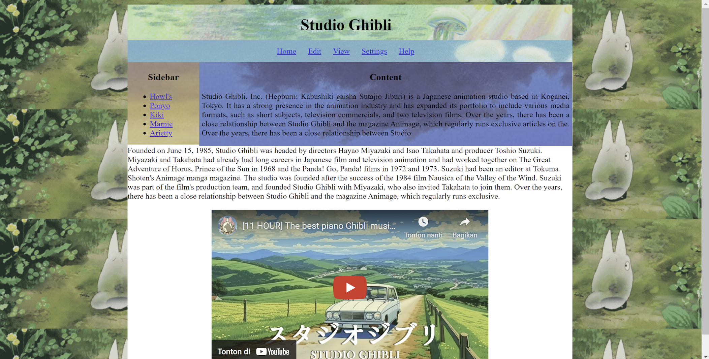

<h1 align="center" style="color:#88c0a9;">My First Project - Ghibli Theme</h1>

  <em> Studio Ghibli is a world-famous Japanese animation studio founded on June 15, 1985, by directors Hayao Miyazaki and Isao Takahata, along with producer Toshio Suzuki. The studio is known for its beautifully hand-drawn animation, emotional storytelling, and fantastical worlds.  It has produced beloved films such as <em>Spirited Away</em>, <em>My Neighbor Totoro</em>, <em>Princess Mononoke</em>, and <em>Kiki's Delivery Service</em>. Ghibli films often explore themes like nature, childhood, courage, and friendship — all wrapped in a calm, magical atmosphere. Over the years, Studio Ghibli has become a symbol of creativity and heartwarming cinema, touching audiences all around the world.
</em>

## 🌐 Live Preview
Visit Website (https://github.com/lyneyy/first-project.git)

## 🖼️ Preview

This is a visual preview of the Ghibli-themed website. The design uses calm, nature-inspired colors and elements from Studio Ghibli’s world to create a peaceful browsing experience. Inspired by films like Totoro and Spirited Away, this project brings warmth and magic into a simple web layout.

